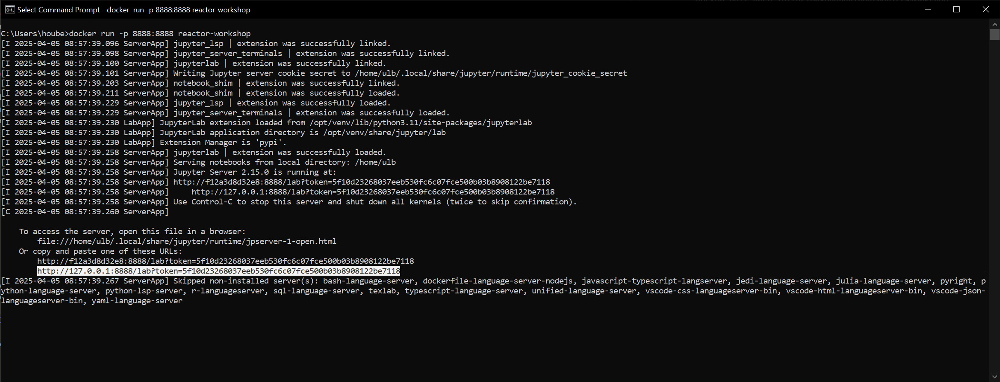

# Reactor Simulation Workshop

Welcome to the Reactor Simulation Workshop! This hands-on tutorial introduces you to reactor physics simulations using Python and OpenMC. The workshop draws materials from two excellent resources: [Neutronics Workshop](https://github.com/fusion-energy/neutronics-workshop.git) and [Reactor Physics with Python](https://github.com/ezsolti/RFP.git).

## Overview

This workshop is designed to:
- Provide a practical introduction to Python programming.
- Teach fundamental reactor physics concepts.
- Offer hands-on experience with open-source nuclear engineering tools.

The workshop also includes supplementary materials on advanced topics such as:
- Building a Monte Carlo particle transport simulator.
- Understanding nuclear data formats and their usage.
- Additional reactor physics tutorials and examples.

## Getting Started

To make this workshop accessible to everyone, we've simplified the setup process by providing a pre-configured Docker environment. This container includes:
- A complete OpenMC installation.
- Pre-installed nuclear data library (ENDF/B-VIII.0).
- All required Python packages.
- An organized folder structure for the workshop materials.

## Installation instructions

- Windows installation video 

    [](https://www.youtube.com/watch?v=jZ_UHi6TRn0)


1. **Install Docker**  
    Install Docker for your operating system:  
    [Ubuntu](https://docs.docker.com/install/linux/docker-ce/ubuntu/),  
    [Mac OS](https://store.docker.com/editions/community/docker-ce-desktop-mac), or  
    [Windows](https://hub.docker.com/editions/community/docker-ce-desktop-windows).  

> [!IMPORTANT]
> If you're using Windows, ensure you also install [WSL](https://learn.microsoft.com/en-us/windows/wsl/install).  
> Run the following command in PowerShell to install WSL:  
> ```powershell  
> wsl --install  
> ```  
> This step is necessary for proper Docker functionality on Windows.

> [!TIP]
> **Verify Docker Installation**  
> To confirm Docker is installed correctly, open a terminal and run:  
> ```bash
> docker --version
> ```  
> This should display the installed Docker version. If you encounter issues, refer to the [Docker troubleshooting guide](https://docs.docker.com/get-docker/#troubleshoot-installation).

2. **Clone the Repository**  
    Clone the reactor-simulation-workshop repository using [Git](https://git-scm.com/book/en/v2/Getting-Started-Installing-Git) or download it directly. Ensure Docker is running, then build the Docker image:  
    ```bash
    git clone https://github.com/daan1392/reactor-simulation-workshop.git
    cd reactor-simulation-workshop
    docker build -t reactor-workshop .
    ```
    <details>
    <summary><b>Don't have Git installed?</b></summary>
    You can download the repository as a ZIP file and unzip it instead.
    </details>
> [!NOTE]
> Building the environment may take considerable time because the full ENDF/B-VIII.0 nuclear data library is downloaded at six different temperatures. This library is approximately 17 GB in size, so ensure your machine has sufficient storage space available before proceeding.

3. **Run the Docker Container**  
    Enable graphics linking between your OS and Docker, then run the container:  
    ```bash
    docker run -p 8888:8888 reactor-workshop
    ```

    <details>
    <summary><b>Permission Denied Errors?</b></summary>
    If you're using a Linux or Ubuntu terminal and encounter permission denied errors, try running the command with elevated permissions:  
    ```bash
    sudo docker run -p 8888:8888 reactor-workshop
    ```  
    Enter your password when prompted.
    </details>

4. **Access the Jupyter Notebook Environment**  
    Once the container is running, a URL will be displayed in the terminal. Open this URL in your web browser to access the Jupyter Notebook environment.  

    

    Inside the environment, you'll find folders such as `/data`, `/Datalabs`, and `/extra`. The `Datalabs` folder contains materials for the seminar, including an introduction to Python, Sapling, nuclear cross sections, depletion, OpenMC basics, and more.